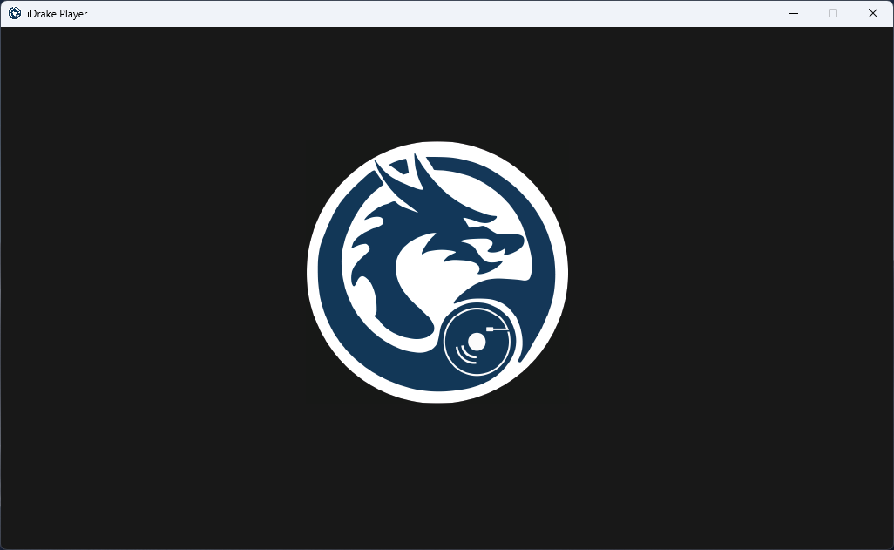

# **iDrake Player** - Python Music Player with Playlist Management

**iDrake Player** is a Python-based music player featuring an intuitive GUI for MP3 playback. It supports essential functionalities like **playlists**, **shuffle**, **volume control**, and **track navigation**.



## Features
- **Play, Pause, Stop & Resume** – Control your music with a click.
- **Playlist Management** – Create, add, export, and import playlists.
- **Shuffle Mode** – Randomize your music with the shuffle option.
- **Volume Control** – Adjust the volume via slider.
- **Track Position Slider** – Navigate through your track with precision.
- **Track Info Display** – View the current song name, time, and duration.
- **File Management** – Easily add, delete, and manage songs.
- **Cross-Platform** – Works with Python and any system that supports `pygame` and `tkinter`.

## High‑Level Goals
1. **Simplicity & User-Friendliness** – The player aims to be easy to use while providing powerful features.
2. **Extendability** – The app is designed to allow future expansions, like streaming or advanced playlist options.
3. **Reliability** – Ensuring smooth music playback and preventing crashes, even with large playlists.

## How to Run

To start the software, use the following command:
```
python iDrake-Player.py
```
~~Alternatively, you can download a pre-compiled `.exe` version from the [Releases](https://github.com/damiandrake0/iDrake-Player/releases) section of the GitHub repository for immediate use.~~ COMING SOON :)

### Requirements
```
pip install pygame mutagen
```

## Usage

1. **Add Songs** – Use the file dialog to add individual songs or multiple songs at once.
2. **Play Songs** – Select a song from the list and click **Play**.
3. **Shuffle Songs** – Enable shuffle to randomize the playback order.
4. **Create Playlists** – Organize songs into playlists, export and import them.
5. **Adjust Volume** – Use the volume slider to change the audio volume.
6. **Navigate Track** – Use the track slider to move to a specific point in the song.

## Contributing & Development

- The code is **well-commented** for easy understanding.
- Built using **tkinter** for the GUI and **pygame** for MP3 playback.
- Contributions are welcome! Feel free to open issues or submit pull requests.

## License

GNU GPL v3 License

Enjoy :)

---

*Last updated: 2025‑04‑24*
